# Wine-Pick-QR

Aplicación web progresiva (PWA) para vinotecas, que permite a los clientes consultar precios y promociones de productos mediante códigos QR o búsqueda por texto, sin necesidad de instalar una app. Incluye un panel de administración para gestionar el catálogo y visualizar métricas de consultas.


## Resumen del proyecto

Este proyecto es un **Trabajo Final Integrador (TFI)** desarrollado para la Tecnicatura Universitaria en Programación de la UTN. Resuelve un problema real: en vinotecas, mantener precios actualizados en cartelería es costoso y genera fricción cuando no coinciden con caja. La solución digitaliza la consulta mediante QR y búsqueda, eliminando carteles físicos mientras captura métricas de interés del cliente.

**Objetivos:**

- Digitalizar consulta de precios y promociones en vinotecas
- Eliminar dependencia de cartelería física y reducir errores en caja
- Capturar métricas sobre productos más consultados
- Entrega como PWA instalable sin requirir app nativa

## Características principales

- Lectura de códigos QR (compatible con cámara de celular)
- Búsqueda por nombre, bodega, varietal u origen
- Ficha de producto con precio actualizado en tiempo real
- Panel de administración (CRUD de productos y promociones)
- Validación de superposición de promociones
- Tipos de promoción: porcentaje, precio fijo, 2x1, 3x2, NxM
- Métricas de productos más consultados (últimos 7/30/90 días)
- Diferenciación de consultas por canal (QR vs búsqueda)
- Instalación como PWA desde el navegador

## Capturas de pantalla

<details>
<summary><b>📱 Versión Móvil (Cliente y Administrador)</b></summary>
<br>

<p align="center">
  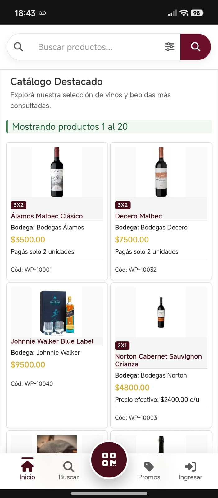
  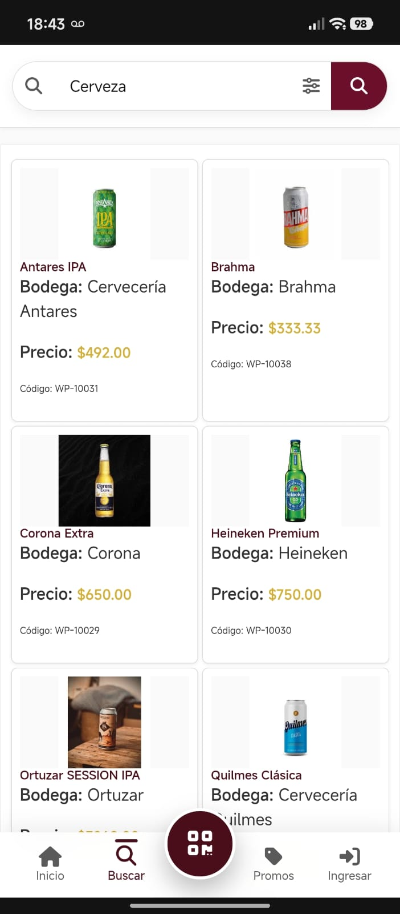
  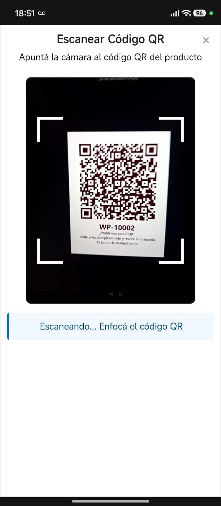
  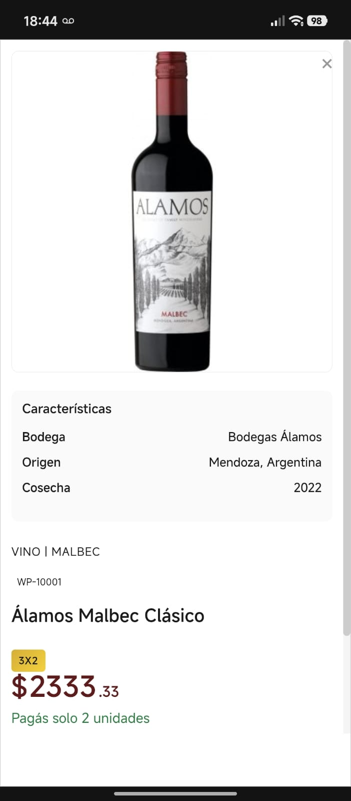
  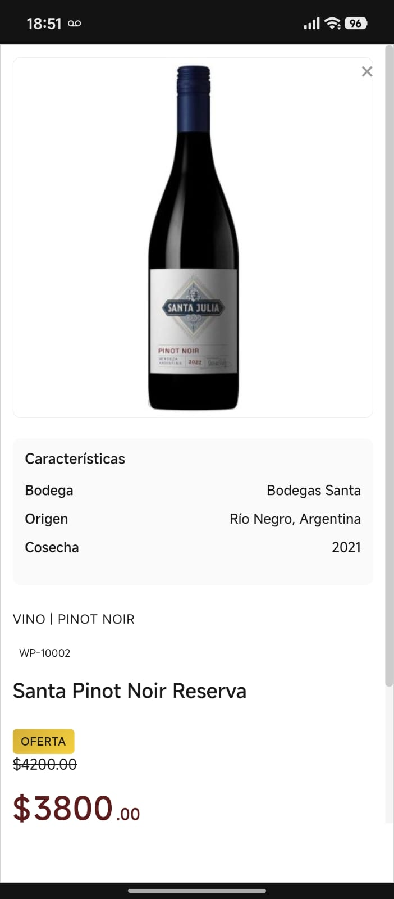
</p>

<p align="center">
  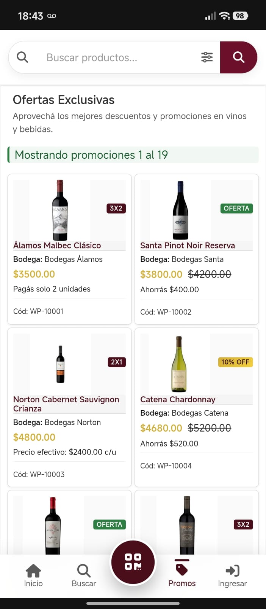
  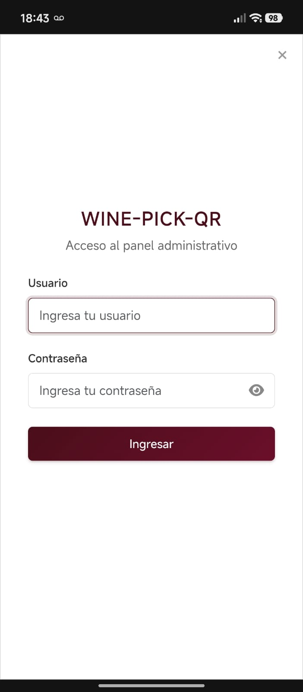
  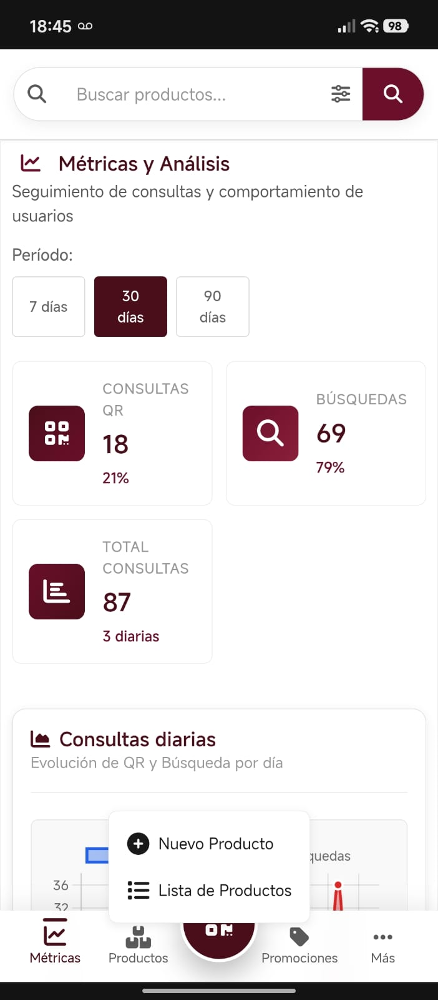
    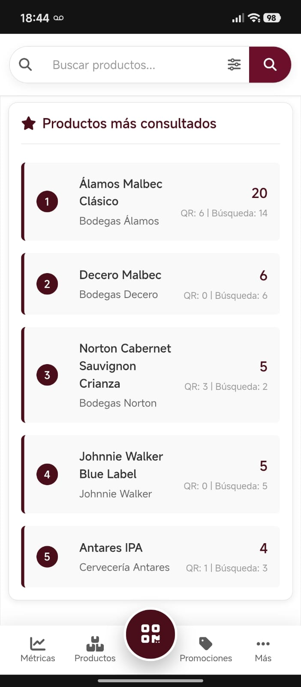
  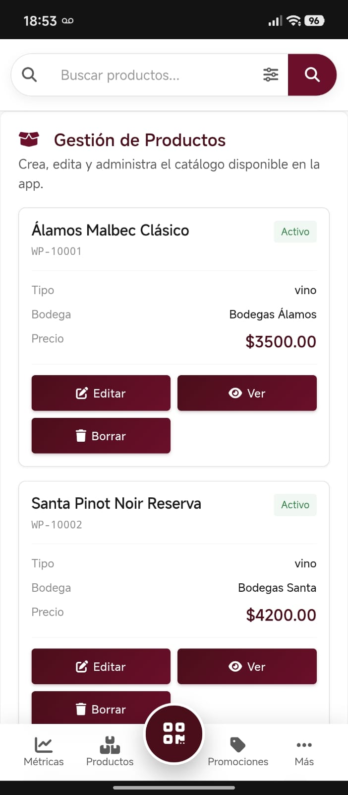
</p>

<p align="center">
  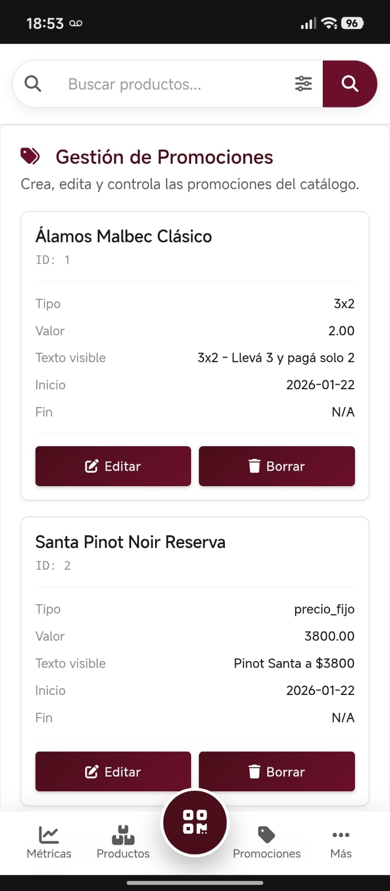
  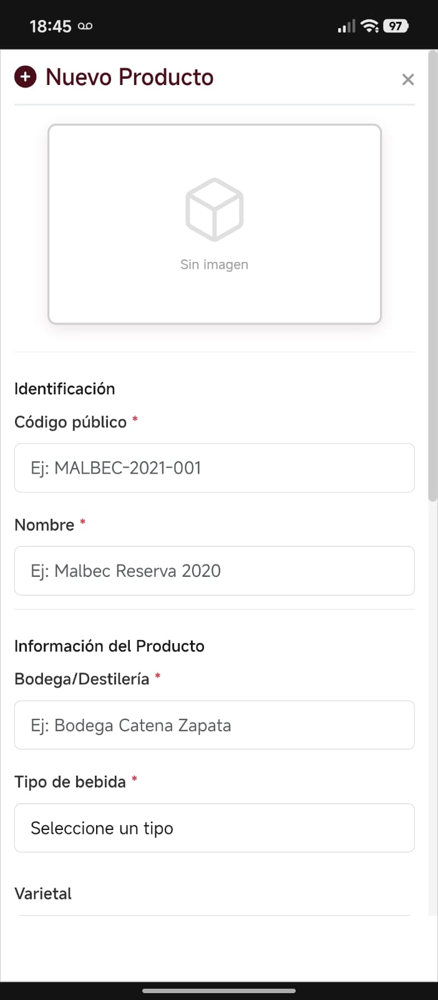
  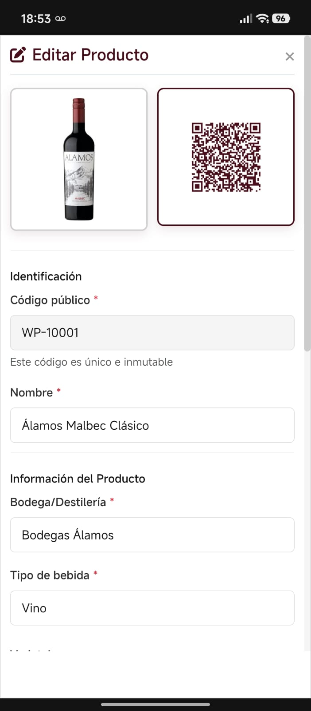
    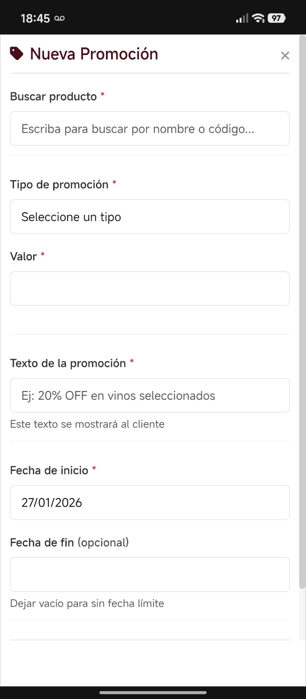
      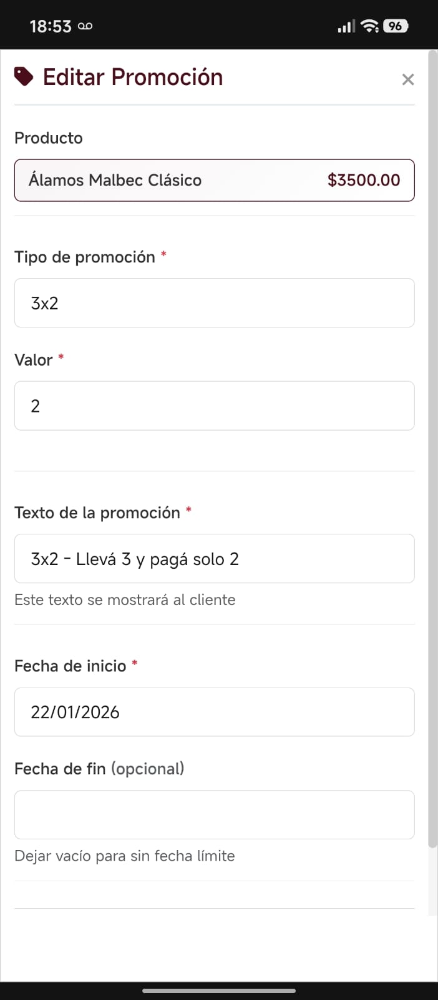
</p>

</details>

<details>
<summary><b>💻 Versión Escritorio (Administrador)</b></summary>
<br>

<p align="center">
  
  
  
</p>

<p align="center">
  
  
  
</p>

<p align="center">
  
  
  
</p>
<p align="center">
  
</p>
</details>

## Arquitectura

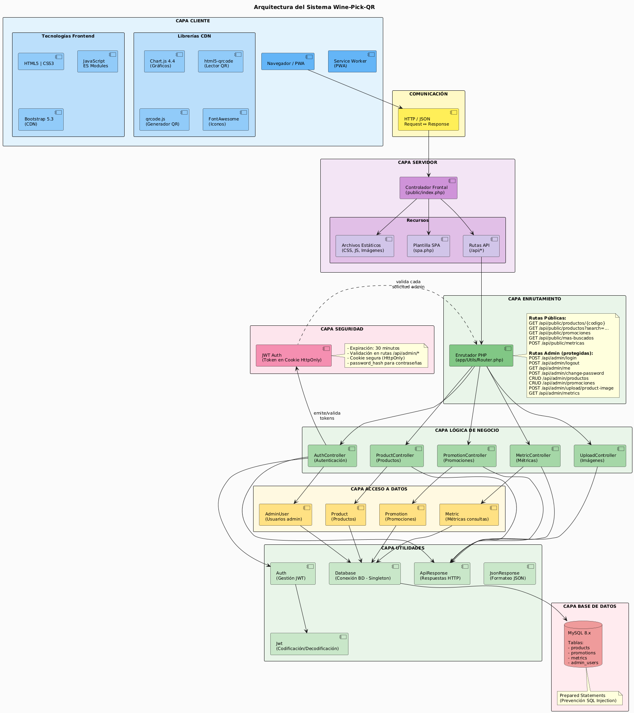

**Flujo típico de consulta pública (QR o búsqueda):**

1. Cliente escanea QR o busca producto
2. Frontend (JS) envía GET a `/api/public/productos?search=..`
3. ProductController valida y consulta Product Model
4. MySQL devuelve datos
5. API responde con JSON
6. Frontend renderiza ficha y registra métrica

**Flujo típico de administración (crear/editar):**

1. Admin inicia sesión → AuthController emite JWT en cookie
2. Admin realiza acción (crear producto)
3. Frontend envía POST a `/api/admin/productos` con token en cookie
4. Auth valida JWT → permite acceso
5. ProductController ejecuta validaciones y llamadas a Model
6. MySQL persiste datos
7. API responde con status de éxito/error

## Tecnologías utilizadas

**Frontend:**

- HTML5, CSS3
- JavaScript ES Modules (vanilla, sin frameworks)
- Bootstrap 5.3.0 (desde CDN)
- Chart.js 4.4.1 (desde CDN para gráficos)
- html5-qrcode (librería local para lector QR)
- qrcode.js (desde CDN para generación de QR)
- FontAwesome (iconos desde CDN)

**Backend:**

- PHP 8.x (con type declarations y arquitectura MVC)
- API REST (respuestas en JSON)
- Router personalizado con mapeo de rutas

**Base de datos:**

- MySQL 8.x

**Seguridad:**

- JWT (autenticación con tokens)
- password_hash (almacenamiento seguro de contraseñas)
- HttpOnly Cookies (almacenamiento seguro de tokens)

**PWA:**

- manifest.json (instalación en pantalla de inicio)
- Service Worker (para cacheo y funcionalidad offline)

**Dependencias:** Ninguna (sin npm, composer ni dependencias externas de código; solo librerías CDN)

## Inicio rápido

### Requisitos previos

- **PHP 8.x** — Motor de backend
- **MySQL 8.x** — Base de datos
- **Navegador moderno** — Chrome, Edge, Safari o Firefox
- **XAMPP** (recomendado para desarrollo local)

### Instalación con XAMPP

1. **Descarga y extrae el proyecto:**
   - Descarga el repositorio o clona: `git clone https://github.com/EstebanRsh/Wine-Pick-QR-TFI.git`
   - Copia la carpeta `Wine-Pick-QR-TFI` a `C:\xampp\htdocs\`

2. **Configura las variables de entorno:**
   - En la raíz del proyecto, copia `.env.example` y renómbralo a `.env`
   - Abre `.env` y verifica/ajusta los valores según tu entorno:

     ```env
     # Entorno de desarrollo
     WPQ_ENV=dev

     # Base de datos (valores por defecto de XAMPP)
     DB_HOST=localhost
     DB_NAME=wine_pick_qr
     DB_USER=root
     DB_PASS=
     DB_CHARSET=utf8mb4

     # URL base (usar esta para desarrollo local con XAMPP)
     BASE_URL=http://localhost/Wine-Pick-QR-TFI

     # Clave JWT (mantener la proporcionada o generar una nueva)
     JWT_SECRET=b5c025c29f1932882a6542a360f34e882cd4ae0a2805e7617372d1c4b6d5a5dc
     ```

3. **Configura la base de datos:**
   - Abre XAMPP Control Panel
   - Inicia **Apache** y **MySQL**
   - Abre http://localhost/phpmyadmin
   - Crea una nueva base de datos llamada `wine_pick_qr` (debe coincidir con `DB_NAME` en `.env`)
   - Importa el archivo `database/database.sql` (selecciona la BD → Importar → elige el archivo)

4. **Accede a la aplicación:**
   - URL: `http://localhost/Wine-Pick-QR-TFI/public/`
   - Usuario admin: `Admin`
   - Contraseña admin: `Admin2026!`

> **Importante:** Cambia la contraseña del administrador después de la primera instalación en `Perfil > Cambiar Contraseña`

> **Seguridad:** Nunca subas el archivo `.env` al repositorio. Usa `.env.example` como referencia.

> **Para más detalles sobre deploy en producción**, consulta [Paquete de Entrega](docs/templates/delivery_package.md)

## Documentación completa

Todos los documentos del proyecto están en `docs/templates/` para referencia:

### Planificación y análisis

- **Project Brief:** [project_brief.md](docs/templates/project_brief.md) — Definición del alcance, objetivos SMART, stakeholders y KPIs
- **Historias de Usuario:** [user_story.md](docs/templates/user_story.md) — Requisitos detallados desde perspectiva del usuario (14 HU)
- **WBS:** [wbs.md](docs/templates/wbs.md) — Descomposición del trabajo y estimación PERT (7 módulos, ~168h)
- **MoSCoW:** [moscow_prioritization.md](docs/templates/moscow_prioritization.md) — Priorización de requisitos

### Ejecución y validación

- **Plan de UAT:** [uat_plan.md](docs/templates/uat_plan.md) — 20 casos de prueba validados
- **QA Checklist:** [qa_checklist.md](docs/templates/qa_checklist.md) — Lista de verificación de calidad
- **Manual de Usuario:** [manual_usuario.md](docs/templates/manual_usuario.md) — Instrucciones paso a paso para clientes y admin
- **Paquete de Entrega:** [delivery_package.md](docs/templates/delivery_package.md) — Guía de deploy y puesta en producción

### Seguimiento del proyecto

- **Actas de Reuniones:** [meeting_minutes.md](docs/templates/meeting_minutes.md) — Registro de decisiones y sprints
- **Registro de Riesgos:** [risk_log.md](docs/templates/risk_log.md) — Riesgos identificados y mitigación
- **Estimación de Costos:** [cost_estimation.md](docs/templates/cost_estimation.md) — Desglose de recursos
- **Retrospectiva:** [retrospective.md](docs/templates/retrospective.md) — Lecciones aprendidas
- **Changelog:** [changelog.md](docs/templates/changelog.md) — Historial de cambios versión a versión

## Estructura de carpetas

```
Wine-Pick-QR-TFI/
├── 📁 app/                          # Backend (Lógica de negocio)
│   ├── 📂 Controllers/              # Controladores REST
│   │   ├── AuthController.php
│   │   ├── ProductController.php
│   │   ├── PromotionController.php
│   │   └── MetricController.php
│   ├── 📂 Models/                   # Modelos de datos
│   │   ├── Product.php
│   │   ├── Promotion.php
│   │   └── AdminUser.php
│   └── 📂 Utils/                    # Utilidades
│       ├── Router.php
│       ├── Database.php
│       ├── Jwt.php
│       └── ApiResponse.php
├── 📁 public/                       # Frontend (Público)
│   ├── 📄 index.php                 # Punto de entrada SPA
│   ├── 📂 js/                       # JavaScript
│   │   ├── app.js
│   │   ├── 📂 core/                 # Funcionalidad central
│   │   ├── 📂 admin/                # Panel de administración
│   │   └── 📂 views/                # Vistas de la aplicación
│   ├── 📂 css/                      # Estilos
│   │   ├── theme.css
│   │   ├── layout.css
│   │   └── components.css
│   ├── 📂 uploads/                  # Imágenes de productos
│   ├── manifest.json                # PWA manifest
│   └── service-worker.js            # PWA cacheo
├── 📁 config/                       # Configuración
│   └── config.php                   # Variables de entorno
├── 📁 database/                     # Base de datos
│   ├── database.sql                 # Schema MySQL
│   └── seed.sql                     # Datos iniciales
├── 📁 templates/                    # Documentación del proyecto
├── 📁 docs/                         # Recursos (imágenes, diagramas)
│   └── 📂 img/
├── 🔑 .env                          # Variables de entorno (NO subir)
├── 📋 .env.example                  # Ejemplo de configuración
├── 📜 README.md                     # Este archivo
└── 📄 LICENSE                       # Licencia MIT
```

## Configuración de seguridad

La configuración sensible se gestiona mediante el archivo `.env` en la raíz del proyecto. **NO EDITES `config/config.php` directamente**, ya que carga automáticamente las variables desde `.env`.

### Variables críticas en `.env`:

```env
# Base de datos
DB_HOST=localhost
DB_NAME=wine_pick_qr
DB_USER=root
DB_PASS=

# JWT - Cambia esto en producción (mínimo 32 caracteres)
JWT_SECRET=b5c025c29f1932882a6542a360f34e882cd4ae0a2805e7617372d1c4b6d5a5dc

# Entorno
WPQ_ENV=dev        # Cambiar a 'prod' en producción
BASE_URL=http://localhost/Wine-Pick-QR-TFI
```

### Buenas prácticas de seguridad:

- **Nunca subas `.env` al repositorio** — Solo `.env.example` debe versionarse
- **Genera un JWT_SECRET único** — Usa `bin2hex(random_bytes(32))` en PHP
- **Cambia las credenciales en producción** — Usuario y contraseña BD diferentes
- **Cambia la contraseña del admin** — Después de la instalación inicial
- **Usa HTTPS en producción** — Actualiza `BASE_URL` a `https://`
- **Usa `WPQ_ENV=prod` en producción** — Desactiva logs verbosos y errores detallados
- **Usa contraseñas fuertes para admin** — Mínimo 10 caracteres, mayúsculas, números, símbolos

## Pruebas y validación

Todos los 20 casos de prueba del **[Plan de UAT](docs/templates/uat_plan.md)** han sido **validados exitosamente**

**Cobertura de pruebas:**

| Área                | Casos           | Estado   |
| ------------------- | --------------- | -------- |
| Escaneo de QR       | UAT-01 a UAT-04 | Aprobado |
| Búsqueda y filtros  | UAT-05 a UAT-06 | Aprobado |
| Promociones         | UAT-07 a UAT-08 | Aprobado |
| Autenticación admin | UAT-09 a UAT-11 | Aprobado |
| CRUD Productos      | UAT-12 a UAT-14 | Aprobado |
| CRUD Promociones    | UAT-15 a UAT-17 | Aprobado |
| Métricas y reportes | UAT-18 a UAT-19 | Aprobado |
| Gestión de sesión   | UAT-20          | Aprobado |

Ver [QA Checklist](docs/templates/qa_checklist.md) para detalles técnicos de validación.

## Declaración de uso de Inteligencia Artificial

Parte del desarrollo de este proyecto fue asistido por herramientas de Inteligencia Artificial (IA), incluyendo generación y revisión de código, documentación y redacción de manuales. Se utilizaron modelos como **Claude (Anthropic)** y **Copilot (OpenAI GPT-4)** para optimizar tiempos, mejorar la calidad del código y asegurar buenas prácticas de desarrollo. Todas las decisiones técnicas y de diseño final fueron validadas y adaptadas por los autores del proyecto.

## Referencias cruzadas con documentos de proyecto

- **Análisis detallado** → [Project Brief](docs/templates/project_brief.md)
- **Requisitos funcionales** → [Historias de Usuario](docs/templates/user_story.md)
- **Roadmap técnico** → [WBS](docs/templates/wbs.md)
- **Validación completa** → [Plan de UAT](docs/templates/uat_plan.md)
- **Puesta en marcha** → [Paquete de Entrega](docs/templates/delivery_package.md)
- **Lecciones aprendidas** → [Retrospectiva](docs/templates/retrospective.md)

## Créditos y contacto

**Autores:**

- [Esteban Rusch](https://github.com/EstebanRsh) — Desarrollador principal
- Jorge Asencio — Desarrollador

**Proyecto:** Trabajo Final Integrador (TFI) — Tecnicatura Universitaria en Programación — UTN (Noviembre 2025 - Febrero 2026)

## Licencia

Este proyecto está bajo la licencia MIT. Consulta el archivo LICENSE para más información.
